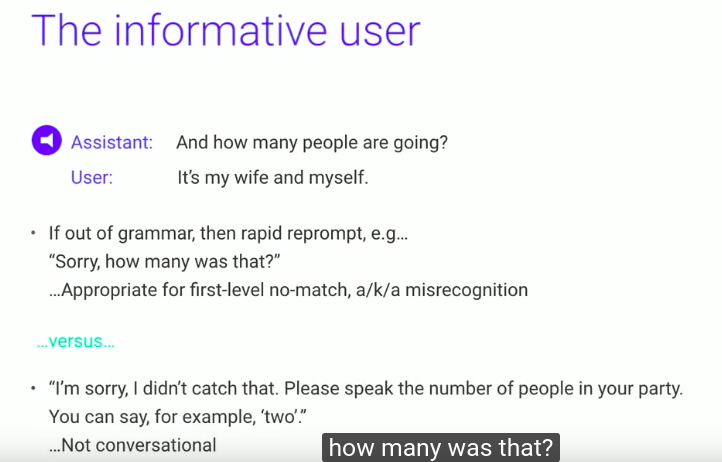
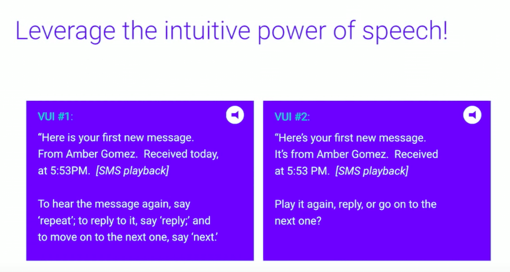

# Assistentes Virtuais: auxiliando nossas vidas

## Introdução

[Primeiro computador com interface de voz](https://www.youtube.com/watch?v=1ZXugicgn6U)

### Internet de todas as coisas

[Internet das coisas/Tec mundo](https://www.youtube.com/watch?v=O8-oiSsZl1Y&t=20)

- [Torradeira imprime previsão do tempo](http://www.detodaforma.com/2014/07/torradeira-que-imprime-previsao-do-tempo.html)

- *Internet das Coisas* vs *Internet de todas as coisas*

positive
: [Vídeo](https://www.youtube.com/watch?v=tAHwaHZS1pc). A **Internet de todas as coisas** conecta: Pessoas, Processos, Dados e Coisas.

## História dos assistentes

### Primeira Era

- **1950**: reconhecimento de um dígito
- **2000**: Diversos sistemas estavam disponíveis.
- Nos EUA, os usuários podiam ligar para pegar informações de tráfegos, ações, atrasos de ônibus (antes dos smartfones)

### Aplicações mobile

- Teorias dos antigos sistemas de voz, são redescobertas.
- Dispostivos multi-modos

## Design de sistemas de voz

- Usuários podem ser interrompidos?
- Quando eles podem falar?
- Balancear visuais

### Por que utilizar Interface por voz?

- **Velocidade**: falamos mais rápido do que digitamos.

- **Mãos livres**: podemos consultar enquanto estamos cozinhando, dirigindo, longe do dispositivo. Mais prático.

- **Intuitivo**: Não precisamos ensinar as pessoas a utilizarem a interface, *todos* sabemos falar.

- **Empatia**: A utilização de entonação, volume e velocidade da pronuncia agrega informações.

### Quando não utilizar

- Espaços públicos
- Desconforto em falar com computador
- Alguns preferem digitar
- Privacidade

### Requisitos para o diálogo

Para estabelecer um diálogo de voz, entre um humano e um computador, precisamos de duas tecnologias:

- reconhecimento de voz (automated speech recognition - ASR) 
- entendimento da linguagem natural (natural-language understanding - NLU)

positive
: **Cooreferencia**: Por favor, pegue a **bola azula** da **caixa vermelha** e traga **ela** para mim.

### Princípio da cooperatividade

Para que um diálogo seja harmonioso, ele deve seguir o princípio da cooperatividade, dividido em 4 partes:

- **Qualidade**: Dizer o que acreditamos ser verdade
- **Quantidade**: Dizer as informações necessárias, não falar mais do que necessário.
- **Relevância**: Falar o que é relevante para a conversa em andamento.
- **Maneiras**: Tentar ser claro e explicar coisas que façam sentido para os outros.

Como sabemos que estamos errando:

- **Qualidade**: *Como posso lhe ajuda*? - mas eu só consigo auxiliar com situações específicas.
- **Quantidade**: *Por favor, escute atentamente porque nossas opções mudaram* (...)
- **Relevância**: *Fornecer instruções que não são úteis no momento*. Ex: explicar política de troca para alguém que ainda não comprou.
- **Maneiras**: Utilização de jargões técnicos.

### Chatbots

- Bots não substituem aplicativos.
- Melhores aplicativos substituem aplicativos.

## Analisando Diálogos

[Diálogo extraídos do canal Google Developers](https://www.youtube.com/watch?v=wuDP_eygsvs&list=PL9kH1vkGoNuia9hI41yPebM2IVIv_Jdty)

### Diálogo 1

### Diálogo 2

### Diálogo 3

### Diálogo 4

<!-- muita informação -->

### Diálogo 5

### Diálogo 6

### Diálogo 7

### Diálogo 8

<!-- *Evitar impressionar, planejar diálogos.* -->

### Diálogo 9

### Diálogo 10

## Dicas

## Personalidades

[Marvin](https://www.youtube.com/watch?v=nQj7qOSrzZ4)

## Dispositivos e tecnologias

### Google Assistant

#### Dispostivo: Google Home

Vídeo de [apresentação do Google Home](https://www.youtube.com/watch?v=r0iLfAV0pIg)

### Amazon Alexa

#### Alexa

[Alexa Development 101 - Full Amazon Echo tutorial course in one video!](https://www.youtube.com/watch?v=4SXCHvxRSNE)

<!--

<iframe width="560" height="315" src="https://www.youtube.com/embed/4SXCHvxRSNE?start=10" frameborder="0" allow="accelerometer; autoplay; encrypted-media; gyroscope; picture-in-picture" allowfullscreen></iframe>

-->

- Alexa / serviços
- Alexa skills / alexa voice service

- Podemos criar os skills e vendê-lo.
- Podemos criar componentes que são compatíveis com o alexa
- Dispositivos: echo, outro dispostivios

[Como criar um skill na Amazon](https://www.youtube.com/watch?v=4SXCHvxRSNE&t=6m09s)

#### Dispostivo: Amazon Echo

## Projetos para 2019

### Marmiratia ou Pizzaria

- Bot (através do WhatsApp) para Marmiratia ou Pizzaria
- Equipamento para impressão dos pedidos e interface administrativa com botões físicos para a cozinha
- Startup

### Secretaria de Municipal do Meio Ambiente

- Bot para [a página da Secretaria de Municipal do Meio Ambiente](http://semma.santarita.pb.gov.br)
- Aplicação de Google Assistente para a Secretaria de Municipal do Meio Ambiente
- Pesquisa sobre personalidade virtual do assistente
- Startup: sistema para Secretarias Municipais do Meio Ambiente

### Limarka: sistema para TCC em Markdown

- Atualização do [Limarka](https://github.com/abntex/limarka/wiki/Apresenta%C3%A7%C3%A3o) para [não necessitar do Latex](https://github.com/abntex/limarka/issues/154)

### Misssão Braços Abertos

- Bot para o [Facebook](https://www.facebook.com/Miss%C3%A3o-Batista-Bra%C3%A7os-Abertos-Santa-Rita-PB-439890752866170/)

### Documentação de software

Elaboração de documentação de softwares (aplicativos de celular), utilizando *esta interface*, utilizada por:

- [google codelabs](http://codelabs.developers.google.com)

- [ubuntu tutorials](https://tutorials.ubuntu.com)
